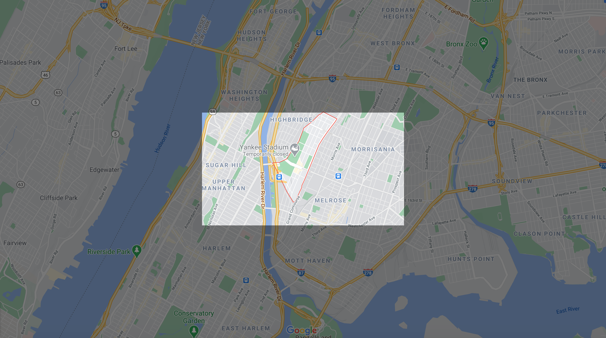
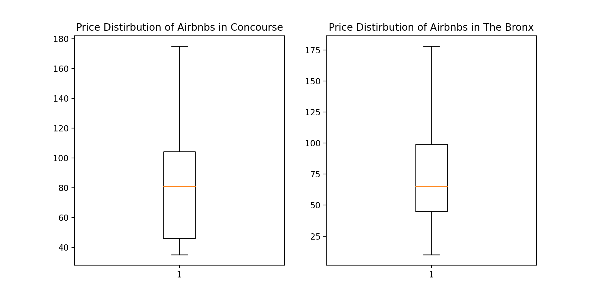
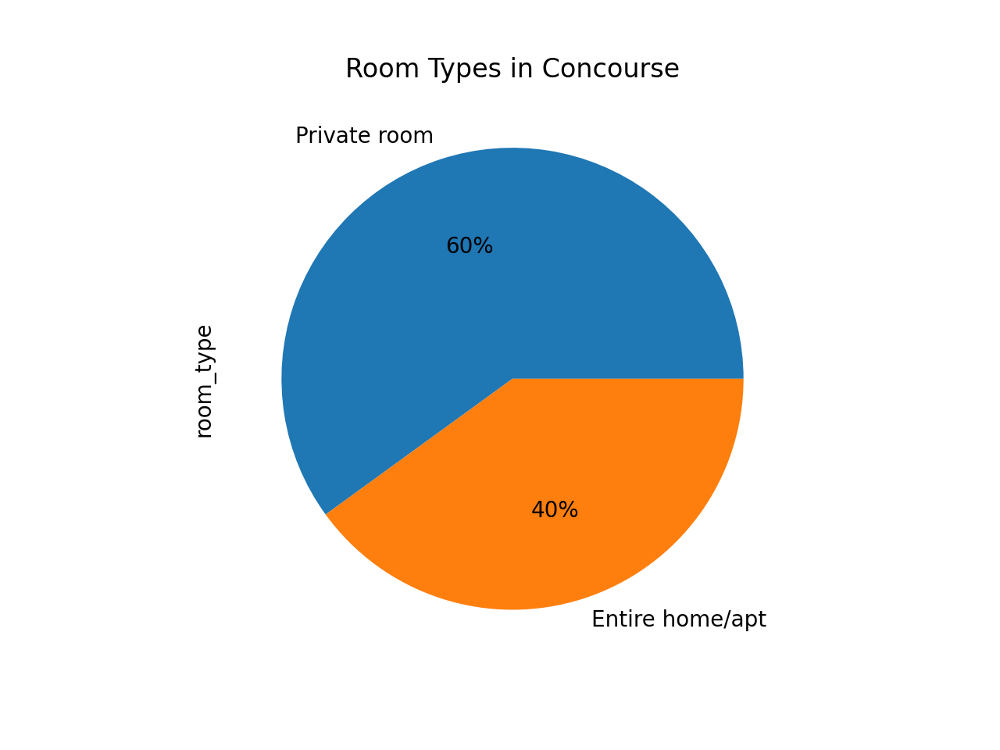
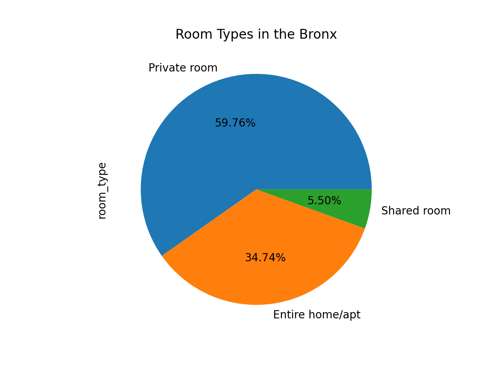
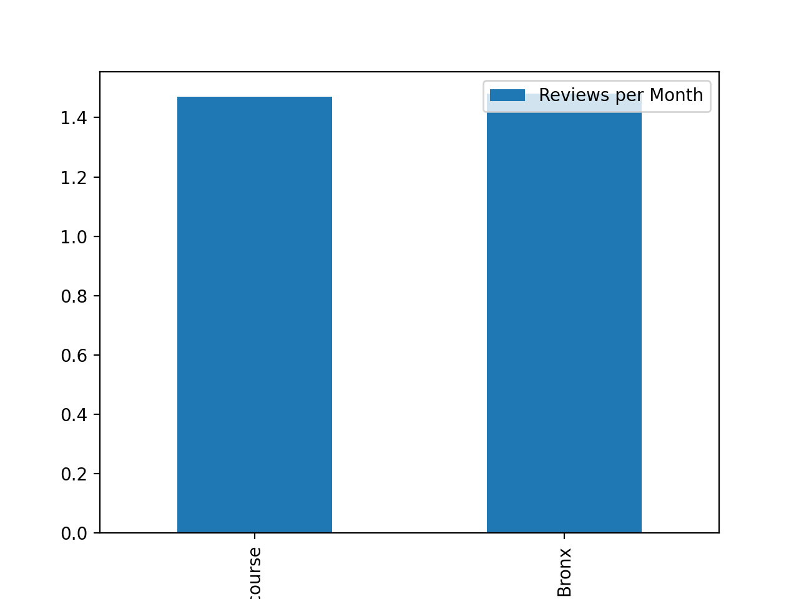

## Concourse Neighborhood AirBnB Listings

### Introduction

Concourse is a neighborhood in the southwestern section of the New York City borough of the Bronx. Its boundaries, starting from the north and moving clockwise, are East 169th Street to the north, Grand Concourse to the east, the Metro-North Railroad's Hudson Line to the south, and Jerome Avenue to the west. The neighborhood is divided into three subsections: West Concourse, East Concourse, and Concourse Village.

### Demographics

(10451)

-47,798 Population

-1.03 Square Miles

-46,447.36 People Per Square Mile

(10452)

-76,078 Population

-0.99 Square Miles

-76,975.77 People Per Square Mile

AirBnB Data: There are 49 AirBnb Listings in
Concourse ranging from a private room to an entire house.

### Concourse Neighborhood Summary 

Concourse → Overall Niche Grade: B

a. Safety: C- (Higher assault and robbery crimes than national average.)

b. Transportation: B+ (Multiple forms of reliable transportation and city parking
available.)

c. Attractions/Activities: A (Multiple parks, restaurants, bars, activities, and nightlife
events.)

When considering a place to book an Airbnb, it's important to consider many of the qualities
that make each neighborhood a good place to live, with some exceptions. Generally, because airbnb's
usually indicate a short stay in a specific neighborhood, most of the qualities which make a
Neighborhood desirable in the long-term can be ignored (good schools, good doctors, best for retirees).
On the other hand, there's an emphasis on benefits that can be appreciated in the short-term, such as
safety and accessibility to local attractions. One feature which is more complicated is the cost of living,
because, while price is important, we must still consider the demand for luxury visits, which are more
desirable in a short-term destination (which Airbnb specializes in) than an actual living situation.

### AirBnB Neighborhood Analysis

-The Bronx makes up 1,091 of the 48,895 listings in New York City. 
-In the Bronx amongst all neighborhoods with Airbnbs, the average cost of staying at an Airbnb is
approximately $87.50, compared to the average cost of renting a Airbnb in the city being
approximately $152.72. Concourse makes up 50 of the 1,091 listings in the Bronx.

-Within the Bronx, the mean prices in Bronx neighborhoods are typically under $100
though Riverdale is an anomalous neighborhood with an average cost of rent of over $400.

-The program shows that the average cost of an Airbnb in Concourse is less than the cost of
Airbnbs in the Bronx as a whole. The lower standard deviation of the concourse data suggests
that the costs for renting an Airbnb is mostly lower than a 100 dollars as compared to the entirety
of the Bronx that has outliers in it which increases the standard deviation.

Figure 1. The box plot helps to demonstrate the quartiles of price in both the Bronx and Concourse, the data however does not include the outliers of the Bronx Price distribution. 

Figure 2 and Figure 3.The pie charts show the percentage of each type of accommodation in the respective listings of each dataframe.
 
Figure 4. The plot bar shows the Review per month for both the Bronx and Concourse. There are no error bars included because the error bars would have went under 0.

### AirBnB Locations 
<dl>
<iframe src="airbnblocations.html" width="600" height="400" frameborder="0" frameborder="0" marginwidth="0" marginheight="0" allowfullscreen></iframe>
</dl>

### Thanks for checking out Concourse! [Click here to head back to the Bronx, and choose another neighborhood.](https://jessicalrsparacio.github.io/TheBronx/#the-breakdown)
